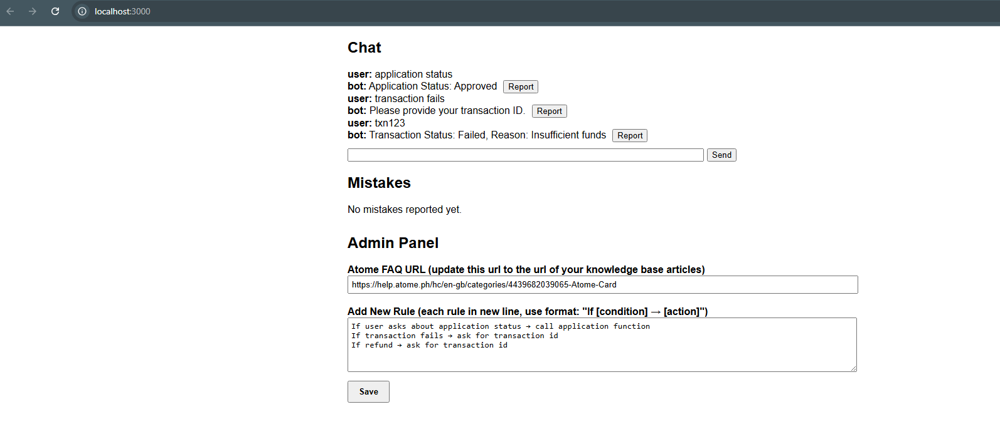
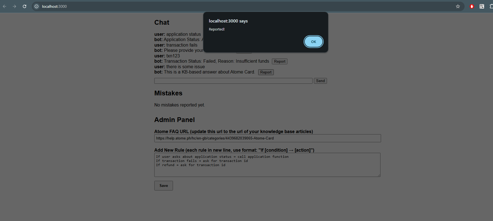
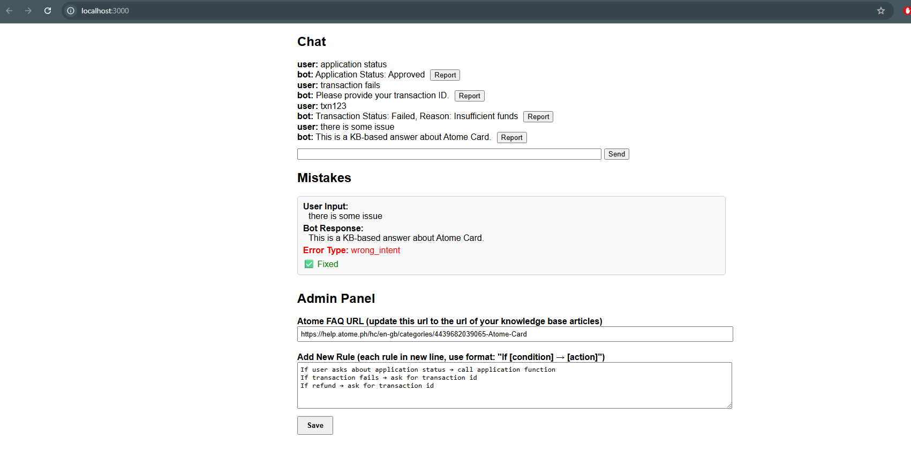

# Project Name

a customer service AI bot

## Overview

Under Chat header, user can type some of the following inputs

application status

transaction fails
txn123

there is some issue

example of chatting with the bot:

example of reporting a bot issue:

example of showing the list of reported issues:

## Running the project

### LLM

start ollama

### Backend

cd backend
npm start

### Frontend

cd frontend
npm run dev
